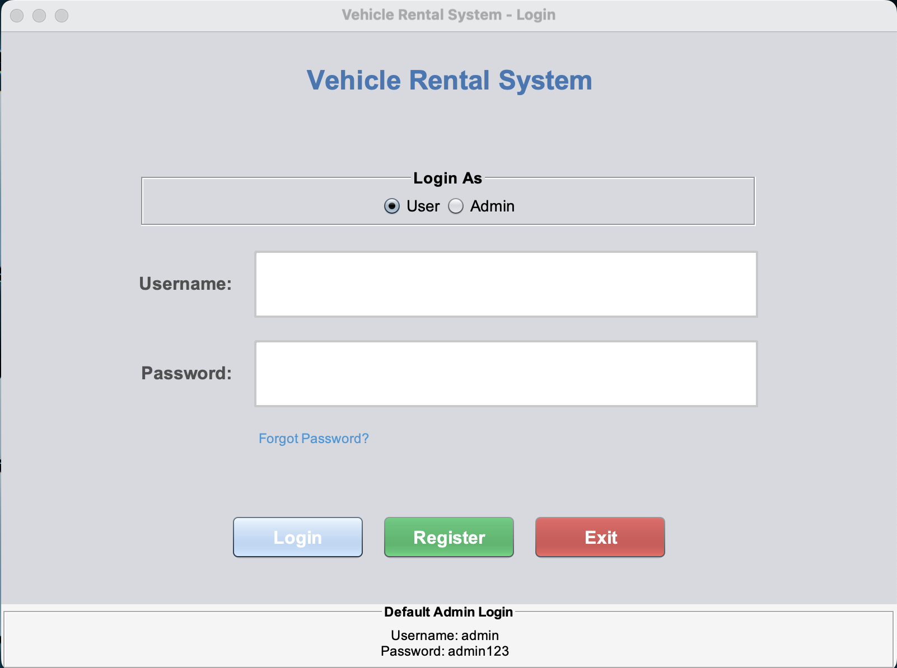
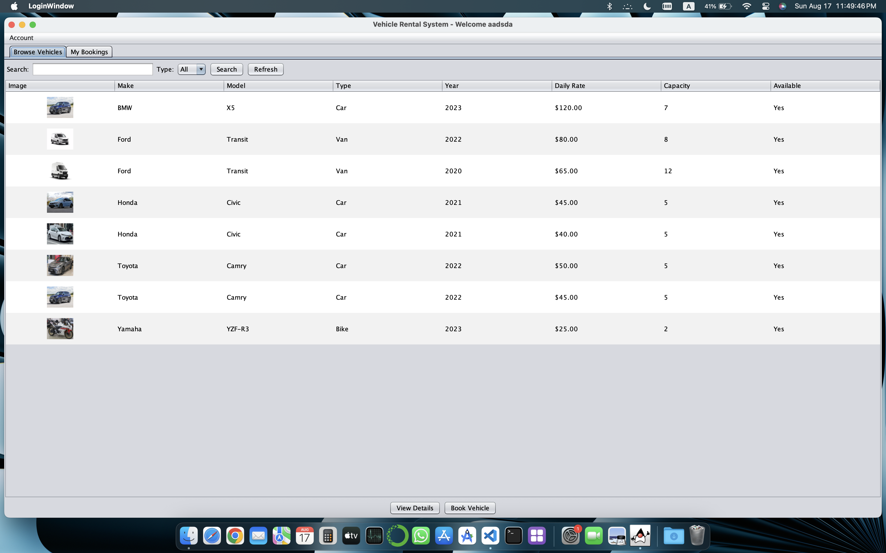
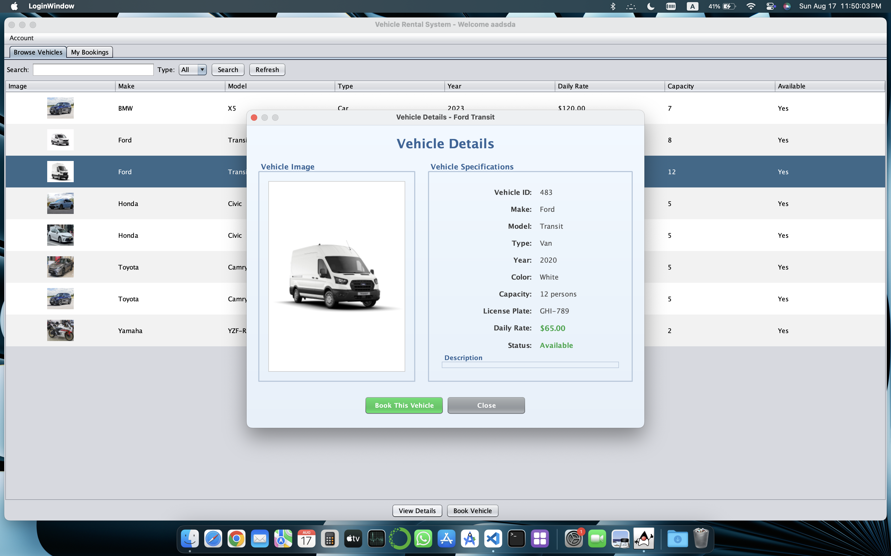
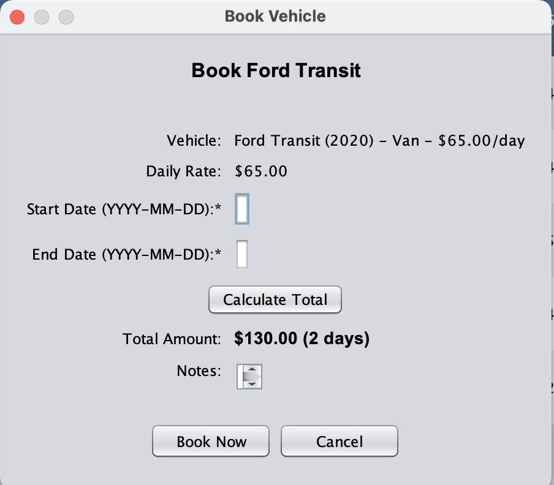
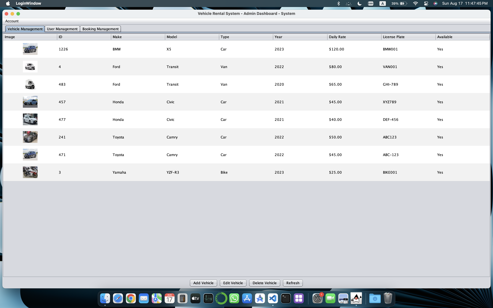
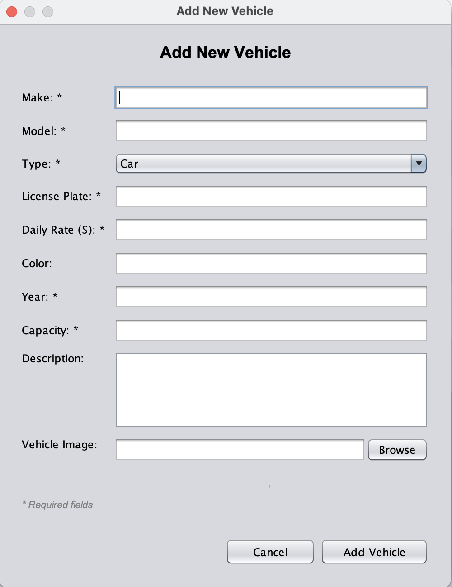
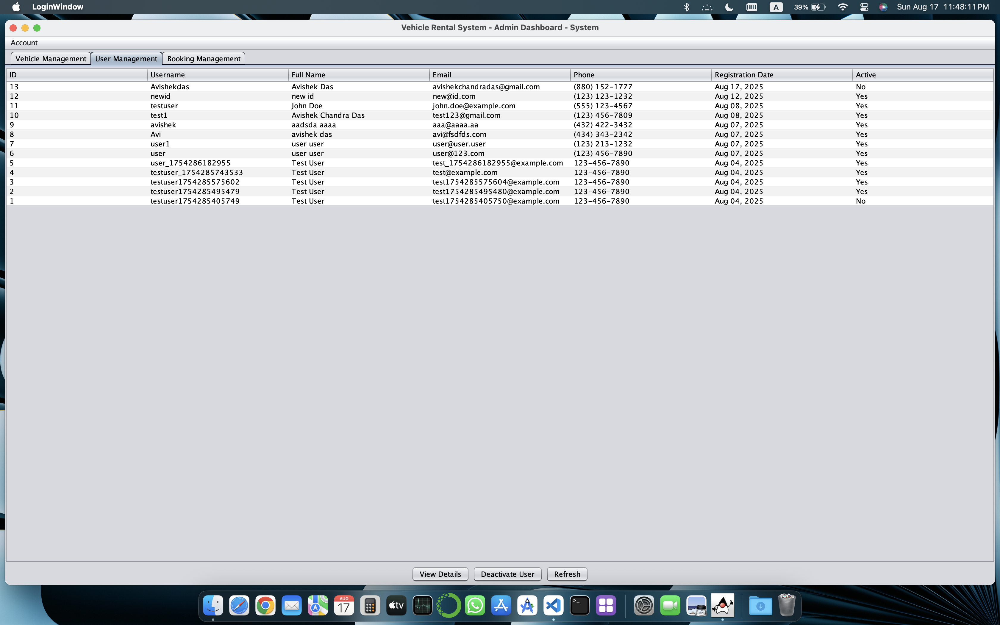
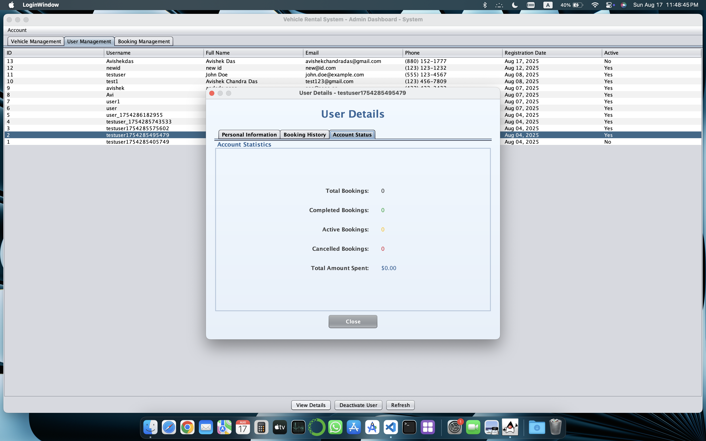
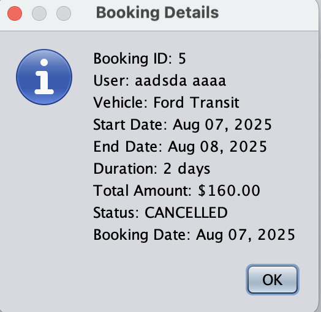
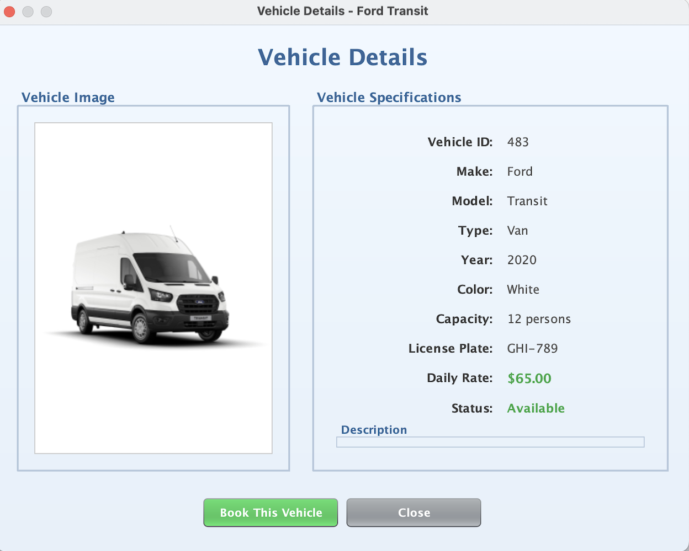

# 🚗 Smart Vehicle Rental System

[](https://www.oracle.com/java/)
[](https://www.sqlite.org/)
[](https://docs.oracle.com/javase/tutorial/uiswi## 📄 License

This project is developed for **educational purposes** as part of academic coursework.

---

## �👨‍💻 Author & Acknowledgments

<div align="center">

### 🎓 **Project Creator**

<table>
<tr>
<td align="center">
<br />
<sub><b>Avishek Chandra Das</b></sub><br />
<sub>Computer Science & Engineering Student</sub><br />
<sub>Metropolitan University</sub>
</td>
</tr>
</table>

**📧 Connect with me:**
<br/>
[](https://github.com/AvishekChandraDas)
[](https://www.linkedin.com/in/avishekchandradas)
[](mailto:avishekchandradas@gmail.com)

</div>

---

### 🎯 **Academic Excellence**

<table>
<tr>
<td>

**🏫 Institution**

</td>
<td>

[**Metropolitan University**](https://metrouni.edu.bd)
<br/>📍 Sylhet , Bangladesh

</td>
</tr>
<tr>
<td>

**👨‍🏫 Course Supervisor**

</td>
<td>

[**Khudeja Khanom Anwara**](https://metrouni.edu.bd/sites/university/faculty-members/department-of-computer-science-engineering/180)
<br/>🎓 Faculty, Computer Science & Engineering

</td>
</tr>
<tr>
<td>

**📚 Course**

</td>
<td>

**Object-Oriented Programming**
<br/>🗓️ Academic Year 2025

</td>
</tr>
<tr>
<td>

**🏆 Project Status**

</td>
<td>

**✅ Academic Excellence Project**
<br/>🌟 Advanced Java Programming Showcase

</td>
</tr>
</table>

---

## � Screenshots

<div align="center">

### 🔐 Login Interface

_Clean and user-friendly authentication system_



---

### 👤 User Dashboard

_Intuitive vehicle browsing and booking interface_



---

### 🚗 Vehicle Details View

_Enhanced vehicle showcase with images and detailed information_



---

### 📋 Booking Process

_Streamlined reservation system with date validation_



---

### 👥 Admin Dashboard

_Comprehensive management dashboard for administrators_



---

### 🔧 Admin Vehicle Management

_Add, edit, and manage vehicle inventory with image upload_



---

### 📊 User Management

_View and manage user accounts and booking history_



---

### 🎨 Enhanced UI Features

_Modern styling with gradient backgrounds and professional design_

<table>
<tr>
<td align="center"><br/><sub><b>User Profile Management</b></sub></td>
<td align="center"><br/><sub><b>Booking Dialog</b></sub></td>
</tr>
<tr>
<td align="center"><br/><sub><b>Vehicle Management Dialog</b></sub></td>
<td align="center"><br/><sub><b>Admin User Details View</b></sub></td>
</tr>
</table>

</div>

---

### 🎨 **Project Design Philosophy**

<div align="center">

```
🎯 EDUCATIONAL EXCELLENCE
├── 💡 Innovation in Learning
├── 🔧 Practical Implementation
├── 📈 Professional Development
└── 🌟 Academic Achievement

🏗️ DEVELOPMENT APPROACH
├── 🎨 Modern UI/UX Design
├── 🏛️ Clean Architecture (MVC)
├── 🔒 Security Best Practices
└── 📱 User-Centered Design
```

</div>

### Direct SQLite Access:

sqlite3 vrs_database.db
.headers on
.mode column
SELECT username, first_name, last_name FROM users;
SELECT username, first_name, last_name FROM admins;
.quit

### 🎯 **Learning Objectives Achieved**

<table>
<tr>
<td width="33%" align="center">

**🔧 Technical Mastery**
<br/>
✅ Advanced Java Programming<br/>
✅ Object-Oriented Design<br/>
✅ Database Integration (JDBC)<br/>
✅ GUI Development (Swing)<br/>
✅ MVC Architecture<br/>

</td>
<td width="33%" align="center">

**💡 Problem Solving**
<br/>
✅ Real-world Application Design<br/>
✅ Complex Business Logic<br/>
✅ Data Validation Systems<br/>
✅ Error Handling Strategies<br/>
✅ Performance Optimization<br/>

</td>
<td width="33%" align="center">

**🎨 Professional Skills**
<br/>
✅ Software Documentation<br/>
✅ Code Organization<br/>
✅ Testing Methodologies<br/>
✅ UI/UX Design Principles<br/>
✅ Project Management<br/>

</td>
</tr>
</table>

---

### 📜 **Usage Rights & License**

<div align="center">

|   **License Type**    |     **Educational License**      |
| :-------------------: | :------------------------------: |
|  🎓 **Academic Use**  |     ✅ **Free & Encouraged**     |
| 🏢 **Commercial Use** |    ❌ **Requires Permission**    |
| 🔄 **Modifications**  |   ✅ **Allowed for Learning**    |
|  📤 **Distribution**  | ⚠️ **With Attribution Required** |

**📋 Usage Guidelines:**

- 🎓 **Students**: Free to study, learn, and modify for educational purposes
- 👨‍🏫 **Educators**: May use as teaching material with proper attribution
- 🏢 **Commercial**: Please contact author for commercial licensing
- 🔄 **Contributors**: Contributions welcome through GitHub pull requests

</div>

---

## 🌟 **Special Acknowledgments**

<div align="center">

### 🙏 **Gratitude & Recognition**

<table>
<tr>
<td align="center" width="25%">

**🗄️ Database**
<br/>
[](https://www.sqlite.org/)
<br/>
_Lightweight & Reliable_

</td>
<td align="center" width="25%">

**☕ Platform**
<br/>
[](https://www.oracle.com/java/)
<br/>
_Robust & Scalable_

</td>
<td align="center" width="25%">

**🖼️ GUI Framework**
<br/>
[](https://docs.oracle.com/javase/tutorial/uiswing/)
<br/>
_Rich & Interactive_

</td>
<td align="center" width="25%">

**🏫 Institution**
<br/>
[](https://metrouni.edu.bd)
<br/>
_Academic Excellence_

</td>
</tr>
</table>

### 💝 **Special Thanks To:**

🎓 **Academic Community**

- Faculty members for guidance and mentorship
- Fellow students for collaboration and peer learning
- Academic institution for providing resources and support

💻 **Technology Partners**

- **Oracle Corporation** for Java platform and comprehensive documentation
- **SQLite Development Team** for the exceptional embedded database engine
- **Open Source Community** for tools, libraries, and inspiration

🌍 **Global Learning Network**

- Stack Overflow community for problem-solving support
- GitHub community for version control and collaboration platform
- Java community for continuous innovation and best practices

---

<div align="center">

**🏆 Academic Achievement Badge**

[](https://github.com/AvishekChandraDas/Vehicle_Rental_System)
[](https://github.com/AvishekChandraDas/Vehicle_Rental_System)
[](https://github.com/AvishekChandraDas/Vehicle_Rental_System)
[](https://github.com/AvishekChandraDas/Vehicle_Rental_System)

_"Excellence in education through practical implementation"_

</div>

</div>

---

## 📊 Project Statistics

- **Total Lines of Code**: 5,000+ lines
- **Programming Language**: Java 17+
- **Database**: SQLite with JDBC
- **Architecture Pattern**: MVC (Model-View-Controller)
- **GUI Framework**: Java Swing
- **Development Time**: [Project Duration]
- **Features Implemented**: 20+ core features

---

## 📸 Screenshots

<div align="center">

### 🔐 Login Interface

_Clean and user-friendly authentication system_


---

### 👤 User Dashboard

_Intuitive vehicle browsing and booking interface_


---

### 🚗 Vehicle Details View

_Enhanced vehicle showcase with images and detailed information_


---

### 📋 Booking Process

_Streamlined reservation system with date validation_


---

### 👥 Admin Dashboard

_Comprehensive management dashboard for administrators_


---

### 🔧 Admin Vehicle Management

_Add, edit, and manage vehicle inventory with image upload_


---

### 📊 User Management

_View and manage user accounts and booking history_


---

### 🎨 Enhanced UI Features

_Modern styling with gradient backgrounds and professional design_

<table>
<tr>
<td align="center"><br/><sub><b>User Profile Management</b></sub></td>
<td align="center"><br/><sub><b>Booking Dialog</b></sub></td>
</tr>
<tr>
<td align="center"><br/><sub><b>Vehicle Management Dialog</b></sub></td>
<td align="center"><br/><sub><b>Admin User Details View</b></sub></td>
</tr>
</table>

</div>

---

*⭐ If you found this project helpful, please consider giving it a star on GitHub!*icense](https://img.shields.io/badge/License-Educational-green.svg)](#license)

A comprehensive desktop application for managing vehicle rentals built with Java and Swing. This system provides an intuitive interface for both users and administrators to handle vehicle bookings, user management, and rental operations.

> **Academic Project**: This project was developed as part of advanced Java programming coursework, demonstrating professional software development practices and design patterns.

---

## 📋 Table of Contents

---

---

## � Features

## 📋 Table of Contents

- [Screenshots](#-screenshots)
- [Features](#-features)
- [Quick Start](#-quick-start)
- [System Requirements](#-system-requirements)
- [Installation & Setup](#️-installation--setup)
- [Project Structure](#-project-structure)
- [Database Schema](#-database-schema)
- [Usage Guide](#-usage-guide)
- [Development Features](#-development-features)
- [Design & Style](#-design--style)
- [Future Enhancements](#-future-enhancements)
- [Troubleshooting](#-troubleshooting)
- [Author & Acknowledgments](#-author--acknowledgments)
- [Contributing](#-contributing)
- [License](#-license)

---

## 🎯 Features

### User Features

- **User Registration & Login**: Secure user authentication system with security question
- **Password Recovery**: Account recovery system using 1 security question
- **Browse Vehicles**: View available vehicles with detailed information
- **Search & Filter**: Find vehicles by type, make, model, or other criteria
- **Vehicle Booking**: Book vehicles for specific date ranges
- **Booking Management**: View, modify, and cancel existing bookings
- **Profile Management**: Update personal information and preferences

### Admin Features

- **Admin Dashboard**: Comprehensive overview of system operations
- **Vehicle Management**: Add, edit, delete, and manage vehicle inventory
- **User Management**: View user accounts and manage user status
- **Booking Management**: Confirm, cancel, and monitor all bookings
- **Real-time Availability**: Track vehicle availability in real-time

### Technical Features

- **Object-Oriented Design**: Clean, modular architecture following OOP principles
- **Database Integration**: SQLite database for reliable data persistence
- **Real-time Updates**: Live updates of vehicle availability and booking status
- **Data Validation**: Comprehensive input validation and error handling
- **Responsive UI**: User-friendly Swing interface with modern look and feel

## System Requirements

- **Java**: JDK 17 or higher
- **Maven**: 3.6 or higher (for building)
- **Operating System**: Windows, macOS, or Linux
- **Memory**: Minimum 512MB RAM
- **Storage**: 50MB free disk space

---

## 🛠️ Installation & Setup

### Option 1: Quick Run (Recommended)

```bash
# Clone the repository
git clone https://github.com/AvishekChandraDas/Vehicle_Rental_System.git
cd Vehicle_Rental_System

# Run directly using provided scripts
./run.sh        # macOS/Linux
run.bat         # Windows
```

### Option 2: Maven Build

If you have Maven installed:

```bash
# Clone or download the project
cd VRS

# Compile the project
mvn clean compile

# Run tests (optional)
mvn test

# Create executable JAR
mvn package
```

### Running the Application

#### Method 1: Using Maven

```bash
mvn exec:java -Dexec.mainClass="com.vrs.VehicleRentalSystemApp"
```

#### Method 2: Using compiled JAR

```bash
java -jar target/vehicle-rental-system-1.0.0-jar-with-dependencies.jar
```

#### Method 3: Direct execution

```bash
java -cp target/classes:target/dependency/* com.vrs.view.LoginWindow
```

---

## 🏗️ Project Structure

```
VRS/
├── src/main/java/com/vrs/
│   ├── controller/          # Business logic controllers
│   │   ├── AdminController.java
│   │   ├── BookingController.java
│   │   ├── UserController.java
│   │   └── VehicleController.java
│   ├── database/            # Data access layer
│   │   ├── AdminDAO.java
│   │   ├── BookingDAO.java
│   │   ├── DatabaseConnection.java
│   │   ├── UserDAO.java
│   │   └── VehicleDAO.java
│   ├── model/              # Data models
│   │   ├── Admin.java
│   │   ├── Booking.java
│   │   ├── User.java
│   │   └── Vehicle.java
│   ├── util/               # Utility classes
│   │   ├── AlertUtils.java
│   │   ├── DateUtils.java
│   │   └── FormatUtils.java
│   ├── view/               # User interface
│   │   ├── AdminDashboard.java
│   │   ├── BookingDetailsDialog.java
│   │   ├── BookingDialog.java
│   │   ├── LoginWindow.java
│   │   ├── UserDashboard.java
│   │   ├── UserProfileDialog.java
│   │   ├── UserRegistrationWindow.java
│   │   └── VehicleDetailsDialog.java
│   └── VehicleRentalSystemApp.java
├── src/main/resources/     # Resource files
├── pom.xml                 # Maven configuration
└── README.md              # This file
```

---

## 🗄️ Database Schema

The application uses SQLite database with the following tables:

### Users Table

- user_id (Primary Key)
- username, password
- first_name, last_name
- email, phone_number
- license_number
- registration_date, is_active

### Vehicles Table

- vehicle_id (Primary Key)
- make, model, type
- license_plate, daily_rate
- is_available, color, year
- capacity, description

### Bookings Table

- booking_id (Primary Key)
- user_id (Foreign Key)
- vehicle_id (Foreign Key)
- start_date, end_date
- total_amount, status
- booking_date, notes

### Admins Table

- admin_id (Primary Key)
- username, password
- first_name, last_name
- email, is_active

---

## 📖 Usage Guide

### For Users

1. **Registration**: Create a new account with valid credentials and security questions
2. **Login**: Access the system using your username and password
3. **Browse Vehicles**: View available vehicles in the main dashboard
4. **Search**: Use filters to find specific vehicle types
5. **Book Vehicle**: Select dates and confirm booking
6. **Manage Bookings**: View and cancel bookings from "My Bookings" tab

### Password Recovery

If you forget your password, you can recover your account using the security question:

1. **Access Recovery**: Click "Forgot Password" on the login screen
2. **Enter Username**: Provide your username to start recovery process
3. **Answer Security Question**: Answer your security question correctly
4. **Set New Password**: Create a new password (minimum 6 characters)
5. **Login**: Use your new password to access your account

**Available Security Questions:**

- What is your favorite teacher's name?
- What is your best friend's name?
- What is your favorite color?
- What is your mother's maiden name?
- What is your pet's name?
- In which city were you born?
- What is your favorite movie?
- What is your favorite food?
- What was your first car model?
- What is your childhood nickname?

**Security Tips:**

- Choose a question you'll remember the answer to
- Keep your answer simple and consistent
- Answer is case-insensitive for recovery

### For Administrators

1. **Login**: Use admin credentials to access admin dashboard
2. **Vehicle Management**: Add new vehicles, edit existing ones, or remove vehicles
3. **User Management**: View user accounts and manage user status
4. **Booking Oversight**: Monitor all bookings, confirm or cancel as needed
5. **System Monitoring**: Track overall system usage and statistics

---

## 🔧 Development Features

- **MVC Architecture**: Clean separation of concerns
- **Exception Handling**: Comprehensive error management
- **Input Validation**: Client-side and server-side validation
- **Database Transactions**: ACID compliance for data integrity
- **Logging**: Built-in logging for debugging and monitoring
- **Extensible Design**: Easy to add new features and modules

---

## 🎨 Design & Style

### 🖼️ Visual Design Philosophy

The Vehicle Rental System follows **modern desktop application design principles** with a focus on:

- **Clean, Professional Interface**: Minimalist design that prioritizes functionality
- **Consistent Visual Language**: Unified styling across all components
- **User-Centric Experience**: Intuitive navigation and clear visual hierarchy
- **Accessibility First**: High contrast colors and readable typography

### 🎯 Design Principles

#### **1. Simplicity & Clarity**

```
✅ Clean layouts with ample whitespace
✅ Clear visual hierarchy with proper typography
✅ Intuitive iconography and button placement
✅ Consistent color coding throughout the application
```

#### **2. Professional Aesthetics**

```
🎨 Modern Segoe UI font family
🎨 Professional color palette (Blues, Grays, Greens)
🎨 Subtle shadows and borders for depth
🎨 Consistent spacing and alignment
```

#### **3. User Experience Focus**

```
⚡ Real-time validation with visual feedback
⚡ Responsive button states (hover, focus, active)
⚡ Progress indicators for long operations
⚡ Contextual help and error messages
```

### 🎪 UI Components & Styling

#### **Color Palette**

```css
/* Primary Colors */
Primary Blue:    #3498db (rgb(52, 152, 219))
Success Green:   #228b22 (rgb(34, 139, 34))
Error Red:       #dc143c (rgb(220, 20, 60))
Warning Orange:  #ff8c00 (rgb(255, 140, 0))

/* Neutral Colors */
Dark Gray:       #2c3e50 (rgb(44, 62, 80))
Medium Gray:     #7f8c8d (rgb(127, 140, 141))
Light Gray:      #ecf0f1 (rgb(236, 240, 241))
White:           #ffffff (rgb(255, 255, 255))
```

#### **Typography System**

```java
// Header Fonts
Main Title:      Segoe UI, Bold, 28px
Section Headers: Segoe UI, Bold, 18px
Card Titles:     Segoe UI, Bold, 16px

// Body Text
Form Labels:     Segoe UI, Plain, 14px
Input Fields:    Segoe UI, Plain, 14px
Body Text:       Segoe UI, Plain, 13px
Help Text:       Segoe UI, Plain, 11px
```

#### **Button Styling**

```java
// Primary Buttons
Background: #3498db (Primary Blue)
Text Color: White
Hover State: Darker blue with subtle glow
Border: None, rounded corners (5px)

// Secondary Buttons
Background: #ecf0f1 (Light Gray)
Text Color: #2c3e50 (Dark Gray)
Hover State: Slightly darker background
Border: 1px solid #bdc3c7

// Success Buttons
Background: #27ae60 (Green)
Text Color: White
Used for: Confirm, Save, Submit actions

// Danger Buttons
Background: #e74c3c (Red)
Text Color: White
Used for: Delete, Cancel destructive actions
```

### 🏗️ Layout Architecture

#### **Window Design Standards**

```
📐 Window Dimensions:
   - Login Window: 400×500px (Fixed)
   - Main Dashboard: 1200×800px (Resizable)
   - Dialog Windows: 600×400px (Modal)

📐 Spacing System:
   - Component Padding: 10-15px
   - Section Margins: 20-30px
   - Form Field Spacing: 8-12px
   - Button Margins: 10px
```

#### **Grid System**

```java
// Layout Manager: GridBagLayout
GridBagConstraints standards:
- Insets: new Insets(5, 5, 5, 5)  // Consistent spacing
- Fill: HORIZONTAL for form fields
- Anchor: WEST for labels, CENTER for buttons
- WeightX: 1.0 for expandable components
```

### 🎭 Interactive Elements

#### **Form Components**

```java
// Text Fields
Border: 1px solid #bdc3c7
Focus Border: 2px solid #3498db
Background: White
Padding: 8px
Corner Radius: 4px

// Validation States
✅ Valid: Green border (#27ae60) + checkmark icon
❌ Invalid: Red border (#e74c3c) + error icon
⚠️ Warning: Orange border (#f39c12) + warning icon
```

#### **Interactive States**

```java
// Hover Effects
Buttons: Subtle color darkening + cursor change
Links: Underline appearance + color change
Form Fields: Border color intensification

// Focus States
Outline: 2px solid #3498db
Box Shadow: 0 0 0 3px rgba(52, 152, 219, 0.2)
Visible focus indicators for accessibility
```

#### **Data Tables**

```java
// Table Styling
Header Background: #34495e (Dark gray)
Header Text: White, Bold
Row Alternating: #f8f9fa / White
Selected Row: #e3f2fd (Light blue)
Border: 1px solid #dee2e6
```

### 📱 Responsive Design Features

#### **Adaptive Layouts**

- **Flexible Components**: Auto-resizing tables and panels
- **Scrollable Content**: Automatic scrollbars for overflow
- **Dynamic Sizing**: Components adapt to content length
- **Multi-Resolution Support**: Works on various screen sizes

#### **Accessibility Features**

```java
// Keyboard Navigation
Tab Order: Logical flow through form elements
Enter Key: Submits forms or activates primary actions
Escape Key: Cancels dialogs and operations

// Screen Reader Support
Alt Text: Descriptive labels for all interactive elements
ARIA Labels: Proper accessibility markup
High Contrast: Clear color distinctions
```

### 🎪 Special UI Features

#### **Real-Time Validation System**

- **Visual Feedback**: Instant color changes and icons
- **Progressive Enhancement**: Validation improves as user types
- **Error Prevention**: Blocks invalid submissions with clear guidance

#### **Password Strength Indicator**

```java
// Visual Progress Bar
Weak (0-25%):   Red background, "Weak" text
Fair (26-50%):  Orange background, "Fair" text
Good (51-75%):  Yellow background, "Good" text
Strong (76-100%): Green background, "Strong" text
```

#### **Auto-Formatting Components**

- **Phone Numbers**: `1234567890` → `(123) 456-7890`
- **Dates**: Smart date picker with validation
- **Currency**: Automatic decimal formatting for prices

### 🖼️ Visual Hierarchy

#### **Information Architecture**

```
1️⃣ Primary Information
   └── Large, bold headers (#2c3e50)
   └── Key data in prominent positions

2️⃣ Secondary Information
   └── Medium-sized labels and values
   └── Supporting details and descriptions

3️⃣ Tertiary Information
   └── Small helper text and metadata
   └── Timestamps and system information
```

#### **Content Prioritization**

- **Action Items**: Bright, contrasting colors
- **Status Information**: Color-coded for quick recognition
- **Navigation Elements**: Consistent positioning and styling
- **Data Display**: Clean tables with clear sorting indicators

---

## 🚀 Future Enhancements

## 🚀 Quick Start

### Prerequisites

- Java JDK 17 or higher
- Git (for cloning the repository)

### Clone and Run

```bash
# Clone the repository
git clone https://github.com/AvishekChandraDas/Vehicle_Rental_System.git
cd Vehicle_Rental_System

# Run the application
./run.sh        # On macOS/Linux
# OR
run.bat         # On Windows
```

### Default Login Credentials

- **Admin**: Username: `admin`, Password: `admin123`
- **User**: Register through the application or create via admin panel

---

## 💻 System Requirements

## Future Enhancements

- **Payment Integration**: Add payment processing capabilities
- **Email Notifications**: Automated booking confirmations and reminders
- **Mobile App**: Companion mobile application
- **Advanced Reporting**: Detailed analytics and reporting features
- **Multi-location Support**: Support for multiple rental locations
- **Vehicle Tracking**: GPS integration for vehicle monitoring

---

## 🔧 Troubleshooting

### Common Issues

1. **Database Connection Error**

   - Ensure SQLite JDBC driver is in classpath
   - Check file permissions in application directory

2. **Java Version Issues**

   - Verify Java 17+ is installed and JAVA_HOME is set correctly
   - Use `java -version` to check current version

3. **Build Failures**

   - Run `mvn clean` before building
   - Ensure Maven dependencies are downloaded

4. **UI Display Issues**
   - Try different look and feel settings
   - Check display scaling settings on high-DPI monitors

### Support

For technical support or bug reports, please check the application logs and ensure all system requirements are met.

---

## 🤝 Contributing

This is an academic project, but suggestions and improvements are welcome! If you'd like to contribute:

1. Fork the repository
2. Create a feature branch (`git checkout -b feature/improvement`)
3. Commit your changes (`git commit -am 'Add some improvement'`)
4. Push to the branch (`git push origin feature/improvement`)
5. Create a Pull Request

---

## 📄 License

This project is developed for educational purposes. All rights reserved.

## Contributors

- Developed as part of Java programming coursework
- Demonstrates real-world application development practices
- Showcases object-oriented programming principles
